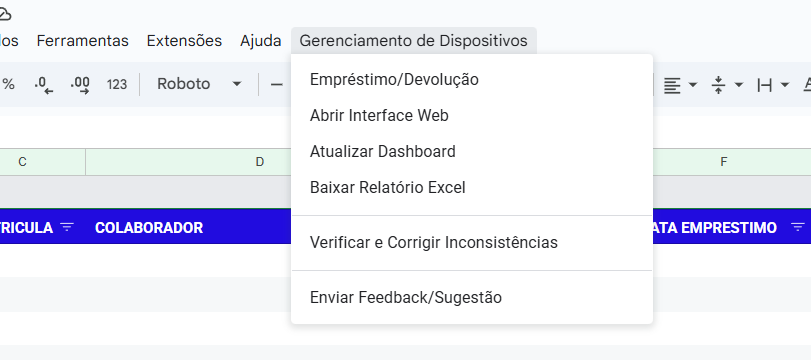
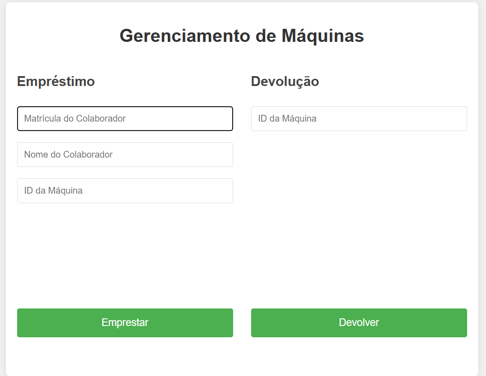
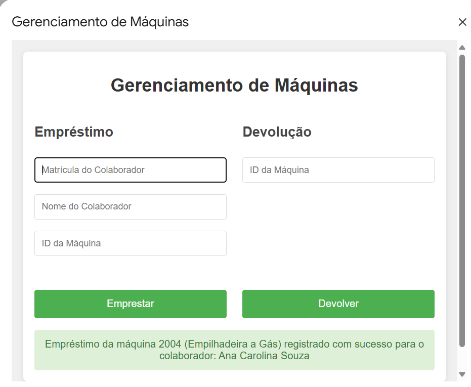
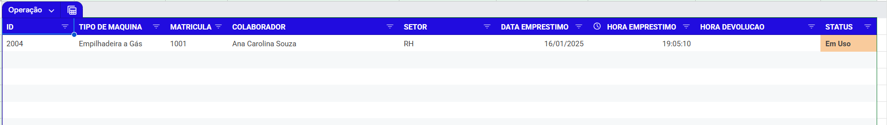

# Sistema de Gerenciamento de Empréstimos de Dispositivos

Este sistema foi desenvolvido para gerenciar empréstimos de dispositivos/máquinas para colaboradores, permitindo o controle eficiente de empréstimos e devoluções.

## Funcionalidades

O sistema oferece as seguintes funcionalidades através do menu "Gerenciamento de Dispositivos":

- Empréstimo/Devolução
- Abrir Interface Web
- Atualizar Dashboard
- Baixar Relatório Excel
- Verificar e Corrigir Inconsistências
- Enviar Feedback/Sugestão

## Como Usar

### Interface Principal

A interface principal do sistema apresenta duas seções principais:

#### Seção de Empréstimo
- Digite a matrícula do colaborador
- O nome do colaborador será preenchido automaticamente
- Insira o ID da máquina
- Clique em "Emprestar"

#### Seção de Devolução
- Digite o ID da máquina que deseja devolver
- Clique em "Devolver"

### Registro de Operações

Após cada operação bem-sucedida, o sistema exibirá uma mensagem de confirmação:

### Planilha de Controle

Os registros são automaticamente atualizados na planilha principal, que contém as seguintes informações:

- ID
- Tipo de Máquina
- Matrícula
- Colaborador
- Setor
- Data Empréstimo
- Hora Empréstimo
- Hora Devolução
- Status

## Configuração do Projeto

Para configurar o projeto em seu ambiente local:

1. Clone este repositório
2. Crie um arquivo `.clasp.json` baseado no `.clasp.json.example`
3. Configure seu `scriptId` e `rootDir` no arquivo `.clasp.json`
4. Execute `clasp login` para autenticar com sua conta Google
5. Execute `clasp push` para enviar o código para o Google Apps Script

## Contribuição

Para contribuir com o projeto:

1. Faça um fork do repositório
2. Crie uma branch para sua feature (`git checkout -b feature/AmazingFeature`)
3. Commit suas mudanças (`git commit -m 'Add some AmazingFeature'`)
4. Push para a branch (`git push origin feature/AmazingFeature`)
5. Abra um Pull Request

## Observações

- O sistema requer permissões adequadas no Google Workspace
- É necessário ter o Google Apps Script habilitado
- Recomenda-se manter backups regulares da planilha de controle 